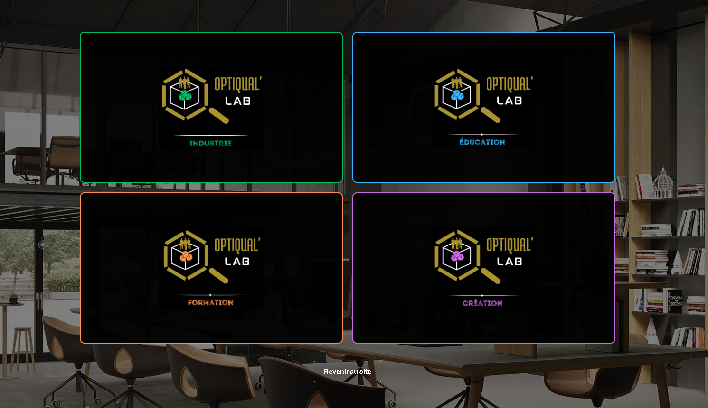
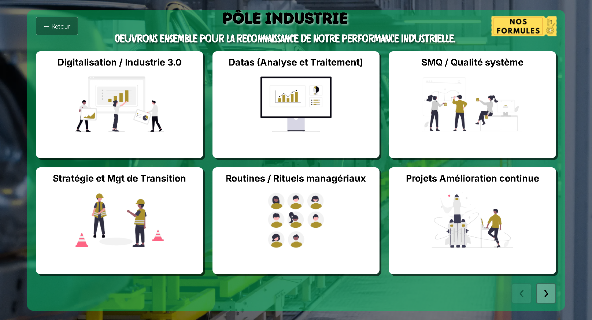
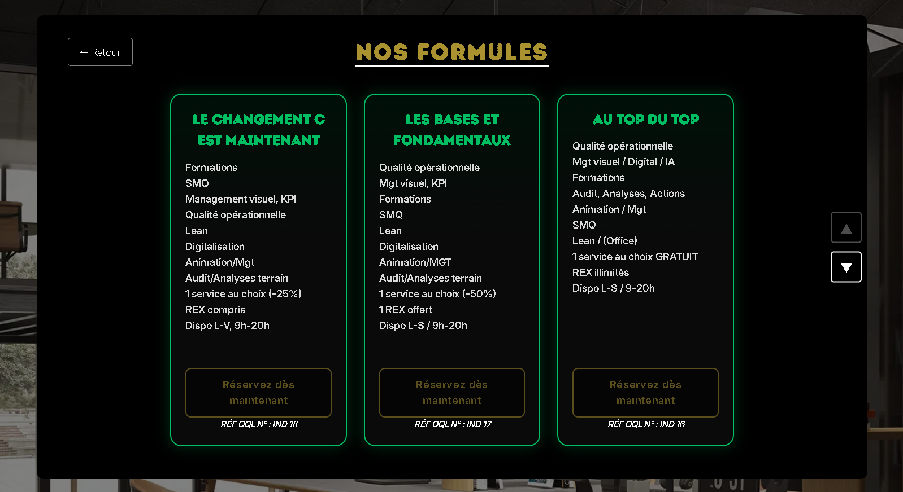

# 🖥️ Optiqual'Lab

Projet réalisé dans le cadre de mon **stage de deuxième année de BUT Informatique** pour **Optiqual'Lab**.

L'objectif était de participer à l'amélioration du site web de l'entreprise en travaillant notamment sur la présentation de ses services et la refonte de certaines interfaces.

---

## 📸 Aperçu

  

  
  

---

## ✨ Réalisations

- 🖥️ Création d'un **tableau de bord interactif** présentant les services de l'entreprise
- ⚛️ Développement des interfaces avec **React**
- 🎨 Création et intégration de nouvelles interfaces à partir de **maquettes Figma**
- 🧩 Développement d'un **plugin WordPress personnalisé** permettant d'intégrer le tableau de bord au CMS
- 🏠 Travail sur la **refonte de la page d'accueil**

---

## 🛠️ Technologies

**Frontend :** React · JavaScript · CSS Modules  
**CMS :** WordPress · Plugin personnalisé  
**Conception :** Figma

---

## 👨‍💻 Mon rôle

J'ai travaillé sur la **conception et le développement de nouvelles interfaces web** pour Optiqual'Lab durant 8 semaines.

J'ai notamment réalisé le tableau de bord présentant les services de l'entreprise, son intégration dans WordPress ainsi qu'une proposition de refonte de la page d'accueil.

Ce projet m'a permis de travailler sur un projet professionnel existant, avec des contraintes liées à l'intégration de nouvelles fonctionnalités dans l'environnement déjà utilisé par l'entreprise.

---

## 🔒 Code source

Ce projet ayant été réalisé dans un cadre professionnel en entreprise, son code source n'est pas disponible publiquement.

Ce repository présente uniquement le projet, les technologies utilisées et quelques aperçus des interfaces réalisées.

---

  Projet réalisé par <strong>Pierre Deldalle</strong> pour <strong>Optiqual'Lab</strong>.

